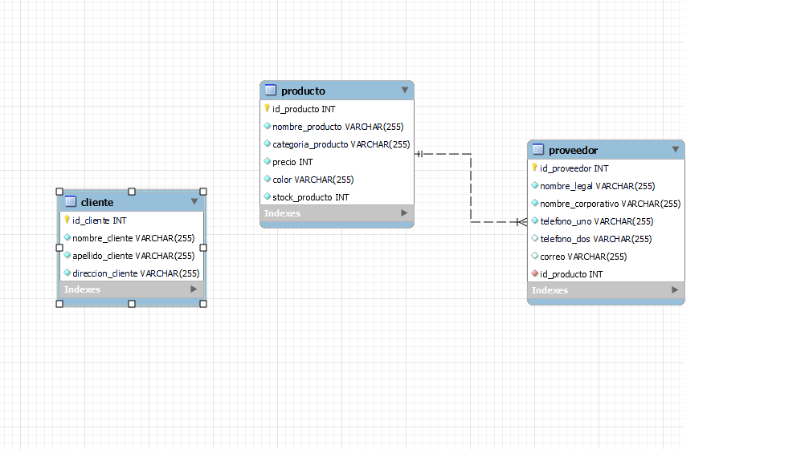

# SPRINT FINAL DEL MÓDULO 3

## Desarrollo Final del Módulo Bases de datos.

## Introducción

En este Sprint realizamos de manera colaborativa la creación de una Base de Datos utilizando el lenguaje SQL para la obtención, manipulación y
definición de datos dando solución a un problema de almacenamiento de información.
Implementando los conocimientos adquiridos en el módulo número 3 del bootcamp Java Full Stack de AwakeLab - Talento Digital para Chile 2023

---

### Tecnologías aplicadas

MySQL

---

## Listado de Entidades

### producto

- id_producto **(PK)**
- nombre_producto
- categoria_producto
- precio
- color
- stock_producto
- id_proveedor **(FK)**

### proveedor

- id_proveedor **(PK)**
- nombre_legal
- nombre_corporaticion
- telefono_uno
- telefono_dos

### cliente

- pais_id **(PK)**
- nombre_cliente
- apellido_cliente
- direccion_cliente

## Relaciones

1. Un **producto** _pertenece_ a muchos **proveedor** (_1 a N_).

## Diagramas

### Modelo Relacional de la BD

---

### Integrantes:

| Marines Espaciales:                                               |
| ----------------------------------------------------------------- |
| Cristian Trureo https://github.com/Cristian-Trureo/sprint_modulo3 |
| Luis Zambrano https://github.com/LuisWork/sprint_modulo3          |
| Marcelo Vargas https://github.com/StudioMontt/sprint_modulo3      |
| Leandro Villalba https://github.com/leanvillalba/sprint_modulo3   |
